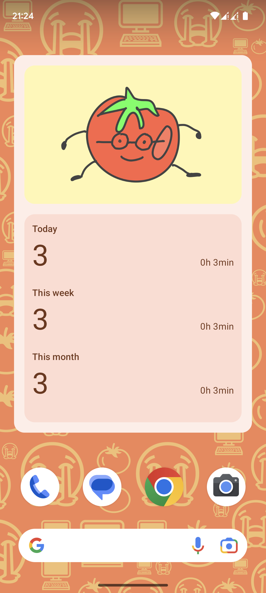
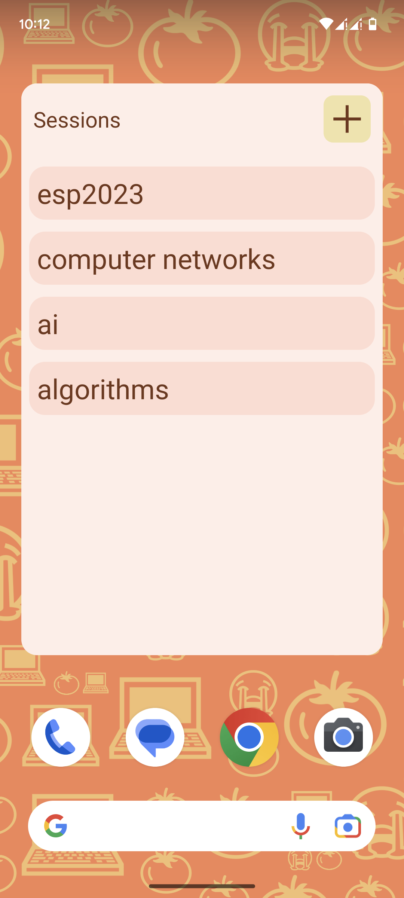

# Pomodoro Timer

Consegna per l'esame del corso di Programmazione di sistemi embedded 2022/2023.

Il progetto esemplifica la creazione di App Widget in Android.

## Autori

- [Riccardo di Bella](https://github.com/riccardodibella)
- [Yihui Zhu](https://github.com/Aerhonburn)
- [Alessandro Balzan](https://github.com/alebal123bal)

## App

La applicazione consiste in un time tracker basato sulla tecnica del pomodoro.

L'enfasi è stata posta sui widget. L'app ne fornisce tre per:

- monitorare la produttività, quindi il numero di pomodori completati e il tempo speso
- controllare il timer: pausa, reset
- visualizzare la lista dei gruppi di task

Tutti i widget si adattano dinamicamente al tema di sistema e alla palette colori dello sfondo(Android 12+) e sono ridimensionabili responsivamente

